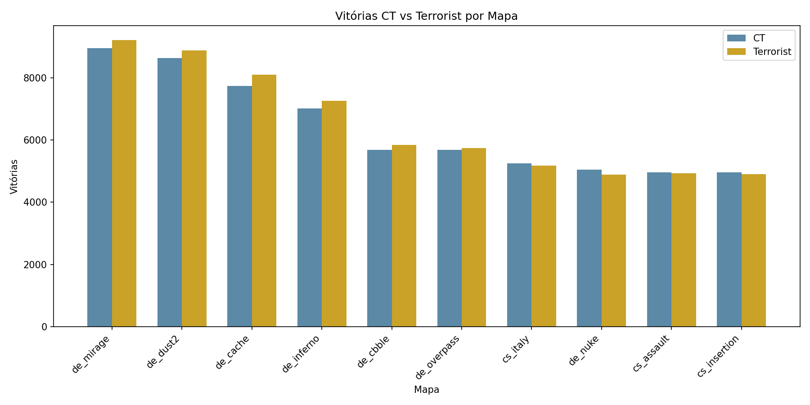
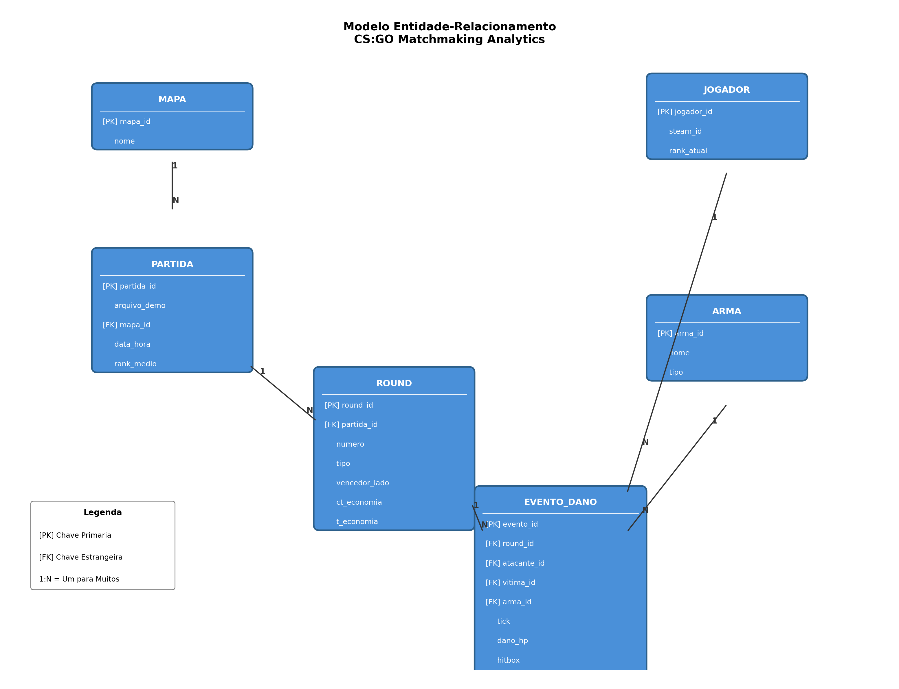
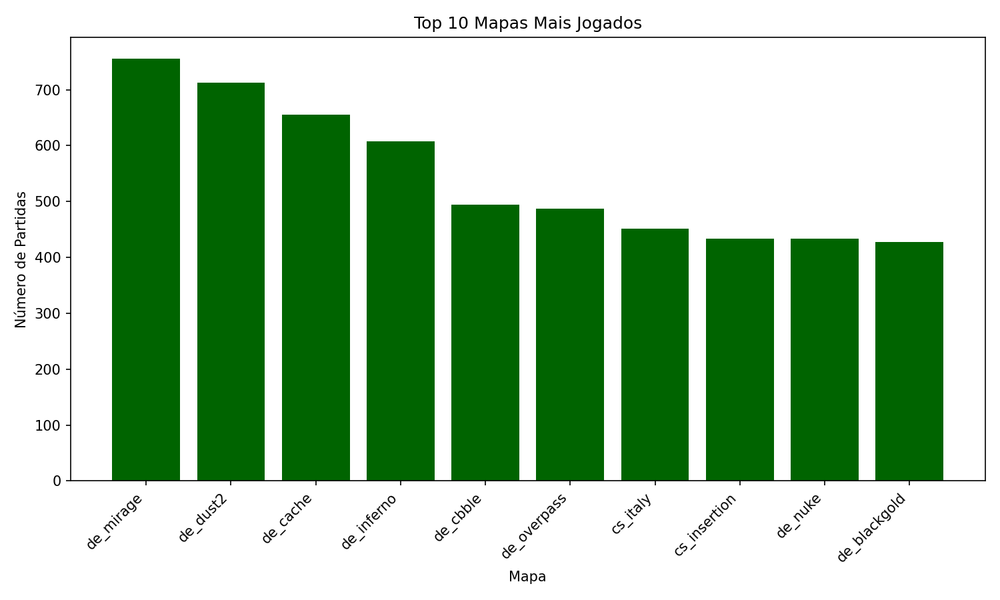
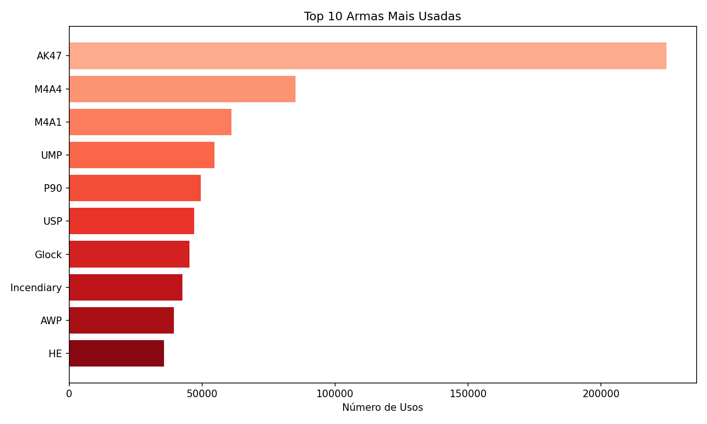
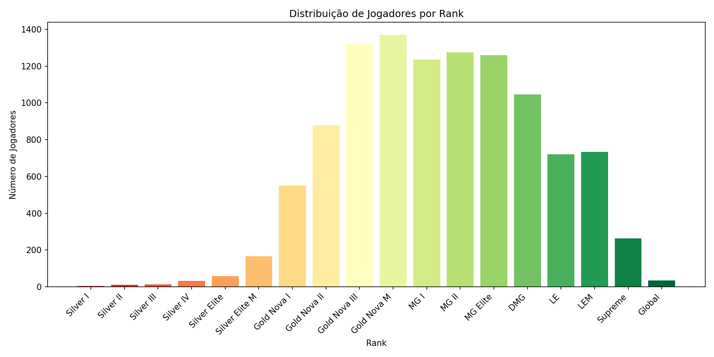

# 🎮 CS:GO Matchmaking Analytics - Projeto Big Data

[](https://www.postgresql.org/)
[](https://www.python.org/)
[](LICENSE)

> Projeto de Engenharia Reversa e Análise de Dados de partidas competitivas de CS:GO Matchmaking.



## 📋 Sobre o Projeto

Este projeto realiza a **engenharia reversa** de uma base de dados pública contendo informações sobre partidas do jogo **Counter-Strike: Global Offensive (CS:GO)**, especificamente do modo Matchmaking competitivo.

O objetivo é demonstrar a aplicação prática de conceitos de banco de dados em uma base de dados real de grande volume (Big Data), incluindo:

- 🔍 Engenharia reversa para identificação de entidades
- 📊 Modelagem conceitual (MER) e lógica
- 🔄 Normalização até 3ª Forma Normal (3FN)
- 💾 Implementação física com PostgreSQL
- 📈 Consultas SQL avançadas
- 📉 Visualização de dados

## 📊 Dados

| Informação | Valor |
|------------|-------|
| **Fonte** | [Kaggle - CS:GO Matchmaking Demos](https://www.kaggle.com/) |
| **Registros Originais** | 955.468 eventos de dano |
| **Total no Banco** | 1.229.974 registros |
| **Entidades** | 6 tabelas normalizadas |

### Modelo de Dados



#### Entidades:
- **JOGADOR** - Jogadores únicos (Steam ID)
- **MAPA** - Mapas do jogo (de_dust2, de_mirage, etc.)
- **ARMA** - Armas disponíveis (AK-47, M4A4, AWP, etc.)
- **PARTIDA** - Partidas jogadas
- **ROUND** - Rounds de cada partida
- **EVENTO_DANO** - Eventos de dano (hits, kills)

## 🛠️ Tecnologias Utilizadas

- **SGBD:** PostgreSQL 15+
- **ETL:** Python 3.10+ com Pandas
- **Visualização:** Matplotlib
- **Modelagem:** brModelo / draw.io

## 📁 Estrutura do Projeto

```
csgo-matchmaking-analytics/
├── README.md                    # Este arquivo
├── base_dados/
│   ├── mm_master_demos.csv     # Base original (955k linhas)
│   └── tabelas_normalizadas/   # CSVs processados
│       ├── jogador.csv
│       ├── mapa.csv
│       ├── arma.csv
│       ├── partida.csv
│       ├── round.csv
│       └── evento_dano.csv
├── docs/                        # Documentação
│   ├── 01_introducao.md
│   ├── 02_dicionario_dados.md
│   ├── 03_modelo_er.md
│   ├── 04_esquema_relacional.md
│   ├── 05_normalizacao.md
│   └── planejamento.md
├── modelos/                     # Diagramas e gráficos
│   ├── diagrama_er.png
│   ├── diagrama_relacional.png
│   └── graficos/
├── scripts/                     # Scripts Python
│   ├── etl_processar_dados.py
│   ├── gerar_dados_sinteticos.py
│   ├── carregar_postgres.py
│   ├── consultas_e_graficos.py
│   └── gerar_diagramas.py
├── sql/                         # Scripts SQL
│   ├── 01_ddl_criar_tabelas.sql
│   └── 03_consultas_avancadas.sql
└── relatorio/
    └── relatorio_final.md
```

## 🚀 Como Executar

### Pré-requisitos

- Python 3.10+
- PostgreSQL 15+
- pip (gerenciador de pacotes Python)

### 1. Clonar o Repositório

```bash
git clone https://github.com/seu-usuario/csgo-matchmaking-analytics.git
cd csgo-matchmaking-analytics
```

### 2. Criar Ambiente Virtual

```bash
python -m venv .venv
# Windows
.venv\Scripts\activate
# Linux/Mac
source .venv/bin/activate
```

### 3. Instalar Dependências

```bash
pip install pandas psycopg2-binary matplotlib tqdm
```

### 4. Baixar Base de Dados

Baixe o arquivo `mm_master_demos.csv` do Kaggle e coloque na pasta `base_dados/`.

### 5. Executar ETL

```bash
cd scripts
python etl_processar_dados.py
python gerar_dados_sinteticos.py
```

### 6. Configurar PostgreSQL

```sql
CREATE DATABASE csgo_analytics;
```

Edite `scripts/carregar_postgres.py` com suas credenciais:

```python
DB_CONFIG = {
    'host': 'localhost',
    'port': 5432,
    'database': 'csgo_analytics',
    'user': 'postgres',
    'password': 'sua_senha'
}
```

### 7. Carregar Dados no Banco

```bash
python carregar_postgres.py
```

### 8. Gerar Gráficos

```bash
python consultas_e_graficos.py
python gerar_diagramas.py
```

## 📈 Análises Realizadas

### Top 10 Mapas Mais Jogados


### Armas Mais Utilizadas


### Distribuição de Ranks


## 🔍 Consultas SQL Avançadas

O projeto inclui 10 consultas SQL avançadas demonstrando:

- ✅ JOINs múltiplos
- ✅ Subconsultas correlacionadas
- ✅ CTEs (Common Table Expressions)
- ✅ Window Functions
- ✅ Agregações com CASE
- ✅ Views

Veja todas em [`sql/03_consultas_avancadas.sql`](sql/03_consultas_avancadas.sql)

## 📝 Documentação

| Documento | Descrição |
|-----------|-----------|
| [Introdução](docs/01_introducao.md) | Origem e descrição dos dados |
| [Dicionário de Dados](docs/02_dicionario_dados.md) | Atributos, tipos e descrições |
| [Modelo ER](docs/03_modelo_er.md) | Entidades e relacionamentos |
| [Esquema Relacional](docs/04_esquema_relacional.md) | Mapeamento MER → Relacional |
| [Normalização](docs/05_normalizacao.md) | Análise 1FN, 2FN, 3FN |
| [Relatório Final](relatorio/relatorio_final.md) | Documento consolidado |

## 👨‍💻 Autor

**[Seu Nome]**
- Curso: [Nome do Curso]
- Instituição: [Nome da Instituição]
- Disciplina: Banco de Dados I

## 📄 Licença

Este projeto está sob a licença MIT. Veja o arquivo [LICENSE](LICENSE) para mais detalhes.

## 🙏 Agradecimentos

- Kaggle pela disponibilização do dataset
- Valve Corporation pelo jogo CS:GO
- Comunidade open-source pelos dados de matchmaking

---

⭐ Se este projeto foi útil, considere dar uma estrela!
