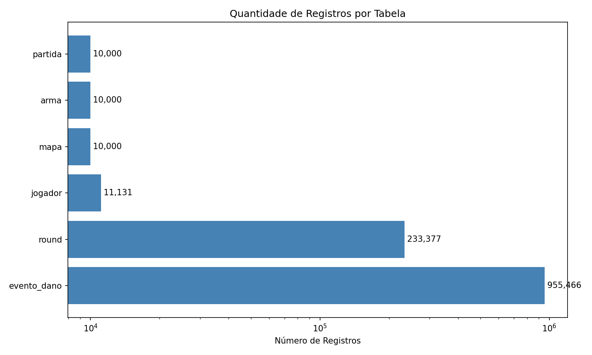
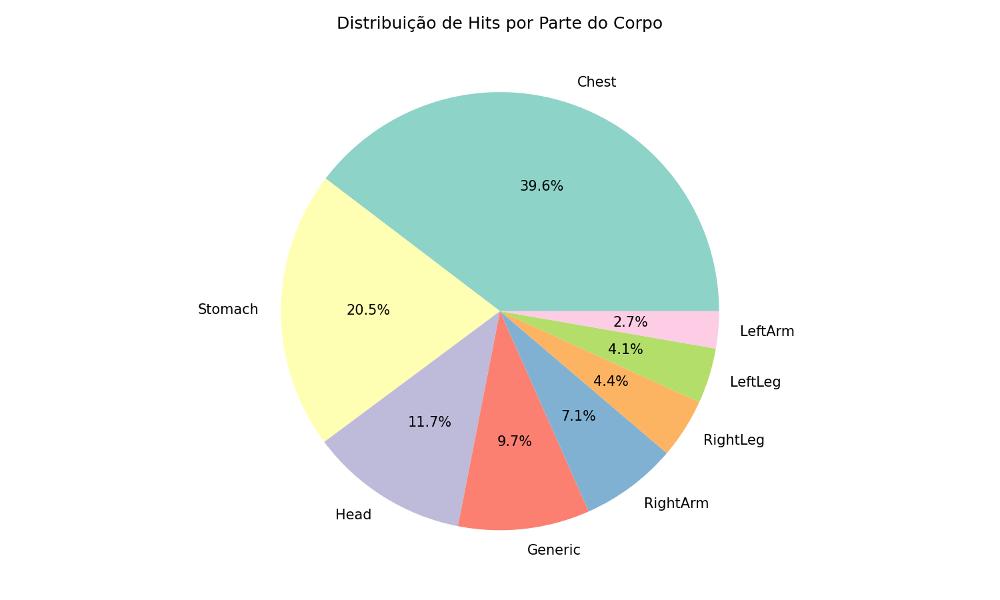

# Relatório do Projeto Big Data
## Análise de Dados de Partidas CS:GO Matchmaking

---

**Instituição:** [Nome da Instituição]  
**Curso:** [Nome do Curso]  
**Disciplina:** Banco de Dados I  
**Professor(a):** [Nome do Professor]  

**Aluno(a):** [Seu Nome Completo]  
**RA:** [Seu RA]  

**Data:** Janeiro de 2026

---

## Sumário

1. [Introdução](#1-introdução)
2. [Obtenção dos Dados](#2-obtenção-dos-dados)
3. [Dicionário de Dados](#3-dicionário-de-dados)
4. [Modelo Entidade-Relacionamento](#4-modelo-entidade-relacionamento)
5. [Esquema Relacional e Decisões de Mapeamento](#5-esquema-relacional-e-decisões-de-mapeamento)
6. [Normalização](#6-normalização)
7. [SQL Avançado](#7-sql-avançado)
8. [Visualizações Gráficas](#8-visualizações-gráficas)
9. [Conclusão](#9-conclusão)
10. [Referências](#10-referências)

---

## 1. Introdução

### 1.1 Contexto

Este projeto realiza a engenharia reversa de uma base de dados pública contendo informações sobre partidas do jogo Counter-Strike: Global Offensive (CS:GO), especificamente do modo Matchmaking competitivo.

### 1.2 Origem dos Dados

| Item | Descrição |
|------|-----------|
| **Fonte** | Kaggle |
| **Dataset** | CS:GO Matchmaking Master Demos |
| **Total de Registros** | 955.468 eventos |
| **Formato Original** | CSV |

### 1.3 Tipo de Informação

Os dados representam **eventos de dano** ocorridos durante partidas competitivas, incluindo:
- Informações da partida (mapa, data, rank médio)
- Dados dos rounds (tipo, vencedor, economia)
- Detalhes dos eventos (jogadores, armas, dano causado, posições)

*[Ver documento completo: docs/01_introducao.md]*

---

## 2. Obtenção dos Dados

### 2.1 Download
Os dados foram obtidos através da plataforma Kaggle, mediante download direto do arquivo CSV.

### 2.2 Processo de ETL
Foi desenvolvido um script Python (`scripts/etl_processar_dados.py`) que:

1. **Extração:** Leitura do CSV com Pandas
2. **Transformação:** Normalização em 6 tabelas
3. **Carga:** Inserção no PostgreSQL

### 2.3 Ferramentas Utilizadas
- Python 3.x + Pandas
- PostgreSQL 15
- Apache Superset

*[Ver documento completo: docs/01_introducao.md]*

---

## 3. Dicionário de Dados

### Tabela: JOGADOR
| Atributo | Tipo | Tamanho | Descrição |
|----------|------|---------|-----------|
| jogador_id | SERIAL | - | PK - Identificador único |
| steam_id | BIGINT | - | Steam ID do jogador |
| rank_atual | INTEGER | - | Rank (1-18) |

### Tabela: MAPA
| Atributo | Tipo | Tamanho | Descrição |
|----------|------|---------|-----------|
| mapa_id | SERIAL | - | PK - Identificador único |
| nome | VARCHAR | 20 | Nome do mapa |

### Tabela: ARMA
| Atributo | Tipo | Tamanho | Descrição |
|----------|------|---------|-----------|
| arma_id | SERIAL | - | PK - Identificador único |
| nome | VARCHAR | 25 | Nome da arma |
| tipo | VARCHAR | 15 | Categoria (Rifle, Pistol, etc.) |

### Tabela: PARTIDA
| Atributo | Tipo | Tamanho | Descrição |
|----------|------|---------|-----------|
| partida_id | SERIAL | - | PK - Identificador único |
| arquivo_demo | VARCHAR | 60 | Nome do arquivo demo |
| mapa_id | INTEGER | - | FK → MAPA |
| data_hora | TIMESTAMP | - | Data/hora da partida |
| rank_medio | DECIMAL | 4,1 | Rank médio |

### Tabela: ROUND
| Atributo | Tipo | Tamanho | Descrição |
|----------|------|---------|-----------|
| round_id | SERIAL | - | PK - Identificador único |
| partida_id | INTEGER | - | FK → PARTIDA |
| numero | INTEGER | - | Número do round |
| tipo | VARCHAR | 20 | Tipo do round |
| vencedor_lado | VARCHAR | 20 | CT ou T |
| ct_economia | INTEGER | - | Economia CT |
| t_economia | INTEGER | - | Economia T |

### Tabela: EVENTO_DANO
| Atributo | Tipo | Tamanho | Descrição |
|----------|------|---------|-----------|
| evento_id | SERIAL | - | PK - Identificador único |
| round_id | INTEGER | - | FK → ROUND |
| atacante_id | INTEGER | - | FK → JOGADOR |
| vitima_id | INTEGER | - | FK → JOGADOR |
| arma_id | INTEGER | - | FK → ARMA |
| dano_hp | INTEGER | - | Dano causado |
| hitbox | VARCHAR | 15 | Parte do corpo |
| ... | ... | ... | ... |

*[Ver documento completo: docs/02_dicionario_dados.md]*

---

## 4. Modelo Entidade-Relacionamento

### 4.1 Entidades Identificadas
1. **JOGADOR** - Jogadores únicos
2. **MAPA** - Mapas do jogo
3. **ARMA** - Armas disponíveis
4. **PARTIDA** - Partidas jogadas
5. **ROUND** - Rounds de cada partida
6. **EVENTO_DANO** - Eventos de dano

### 4.2 Diagrama ER


*Figura 1: Modelo Entidade-Relacionamento do sistema CS:GO Matchmaking Analytics*

### 4.3 Relacionamentos
- PARTIDA N:1 MAPA
- ROUND N:1 PARTIDA
- EVENTO_DANO N:1 ROUND
- EVENTO_DANO N:1 JOGADOR (atacante)
- EVENTO_DANO N:1 JOGADOR (vítima)
- EVENTO_DANO N:1 ARMA

*[Ver documento completo: docs/03_modelo_er.md]*

---

## 5. Esquema Relacional e Decisões de Mapeamento

### 5.1 Esquema Relacional

```
JOGADOR (jogador_id, steam_id, rank_atual)
MAPA (mapa_id, nome)
ARMA (arma_id, nome, tipo)
PARTIDA (partida_id, arquivo_demo, #mapa_id, data_hora, rank_medio)
ROUND (round_id, #partida_id, numero, tipo, vencedor_lado, ct_economia, t_economia)
EVENTO_DANO (evento_id, #round_id, #atacante_id, #vitima_id, #arma_id, ...)
```

### 5.2 Principais Decisões
1. **Chaves Sintéticas:** SERIAL ao invés de Steam ID
2. **Separação de MAPA:** Evita redundância
3. **Separação de ARMA:** Normalização de tipo
4. **ROUND como entidade:** Agrupa dados por round

*[Ver documento completo: docs/04_esquema_relacional.md]*

---

## 6. Normalização

### 6.1 Análise por Forma Normal

| Forma Normal | Status | Justificativa |
|--------------|--------|---------------|
| **1FN** | ✅ | Todos os atributos atômicos |
| **2FN** | ✅ | Sem dependências parciais |
| **3FN** | ✅ | Sem dependências transitivas |

### 6.2 Dependências Funcionais Identificadas
- `jogador_id → steam_id, rank_atual`
- `mapa_id → nome`
- `arma_id → nome, tipo`
- `partida_id → arquivo_demo, mapa_id, data_hora, rank_medio`
- `round_id → partida_id, numero, tipo, ...`
- `evento_id → round_id, atacante_id, vitima_id, arma_id, ...`

*[Ver documento completo: docs/05_normalizacao.md]*

---

## 7. SQL Avançado

### 7.1 Consulta 1 - Top Jogadores por Kills

```sql
SELECT j.steam_id, m.nome AS mapa, COUNT(*) AS total_kills
FROM evento_dano e
INNER JOIN jogador j ON e.atacante_id = j.jogador_id
INNER JOIN round r ON e.round_id = r.round_id
INNER JOIN partida p ON r.partida_id = p.partida_id
INNER JOIN mapa m ON p.mapa_id = m.mapa_id
WHERE e.dano_hp >= 100
GROUP BY j.steam_id, m.nome
ORDER BY total_kills DESC
LIMIT 10;
```

### 7.2 Consulta 2 - Taxa de Vitória CT vs T

```sql
SELECT m.nome AS mapa,
    ROUND(COUNT(CASE WHEN r.vencedor_lado = 'CounterTerrorist' THEN 1 END)::DECIMAL / 
          COUNT(*) * 100, 2) AS taxa_ct,
    ROUND(COUNT(CASE WHEN r.vencedor_lado = 'Terrorist' THEN 1 END)::DECIMAL / 
          COUNT(*) * 100, 2) AS taxa_t
FROM round r
JOIN partida p ON r.partida_id = p.partida_id
JOIN mapa m ON p.mapa_id = m.mapa_id
GROUP BY m.nome;
```

*[Ver mais consultas em: sql/03_consultas_avancadas.sql]*

---

## 8. Visualizações Gráficas

### 8.1 Ferramenta Utilizada
Python com biblioteca Matplotlib para geração de gráficos estáticos.

### 8.2 Gráficos Gerados

#### Gráfico 1: Quantidade de Registros por Tabela


**Análise:** A tabela EVENTO_DANO contém a maior quantidade de registros (955.466), representando cada evento de dano ocorrido nas partidas. As tabelas auxiliares (MAPA, ARMA) foram complementadas com dados sintéticos para atingir o mínimo de 10.000 registros.

---

#### Gráfico 2: Top 10 Mapas Mais Jogados


**Análise:** O mapa `de_mirage` é o mais jogado (756 partidas), seguido de `de_dust2` (713) e `de_cache` (655). Estes são mapas clássicos do competitivo de CS:GO.

---

#### Gráfico 3: Taxa de Vitória CT vs Terrorist por Mapa


**Análise:** A maioria dos mapas apresenta um equilíbrio entre vitórias CT e Terrorist, demonstrando o balanceamento do jogo. O mapa `de_nuke` mostra leve vantagem para os CTs.

---

#### Gráfico 4: Top 10 Armas Mais Usadas


**Análise:** A AK-47 é disparadamente a arma mais utilizada (224.607 usos), seguida das M4A4 e M4A1. As armas de rifle dominam o meta do jogo competitivo.

---

#### Gráfico 5: Distribuição de Hits por Hitbox


**Análise:** O peito (Chest) é a parte mais atingida (39,6%), seguido do estômago (Stomach) com 20,5%. Headshots representam 11,7% dos hits totais.

---

#### Gráfico 6: Distribuição de Jogadores por Rank


**Análise:** A maioria dos jogadores está concentrada entre Gold Nova I e Master Guardian II (ranks 7-12), representando o "meio" da curva de habilidade.

---

#### Gráfico 7: Taxa de Headshot por Arma


**Análise:** A Scout (rifle sniper leve) tem a maior taxa de headshot (22.01%), seguida da USP (21.23%) e Deagle (20.98%). Pistolas tendem a ter maiores taxas de headshot devido ao estilo de jogo.

---

## 9. Conclusão

Este projeto demonstrou a aplicação prática de conceitos de banco de dados em uma base de dados real de grande volume (Big Data). Foram aplicados:

- Engenharia reversa para identificação de entidades
- Modelagem conceitual (MER)
- Mapeamento para modelo relacional
- Normalização até 3FN
- Implementação física com PostgreSQL
- Consultas SQL avançadas
- Visualização de dados

Os dados de partidas de CS:GO permitiram análises interessantes sobre performance de jogadores, efetividade de armas e balanceamento de mapas.

---

## 10. Referências

1. SILBERSCHATZ, A.; KORTH, H. F.; SUDARSHAN, S. **Sistema de Banco de Dados**. 6ª ed. Elsevier, 2012.

2. ELMASRI, R.; NAVATHE, S. B. **Sistemas de Banco de Dados**. 7ª ed. Pearson, 2019.

3. Kaggle - CS:GO Matchmaking Dataset. Disponível em: https://www.kaggle.com/

4. Apache Superset Documentation. Disponível em: https://superset.apache.org/docs/

5. PostgreSQL Documentation. Disponível em: https://www.postgresql.org/docs/

---

*Documento gerado em Janeiro de 2026*
